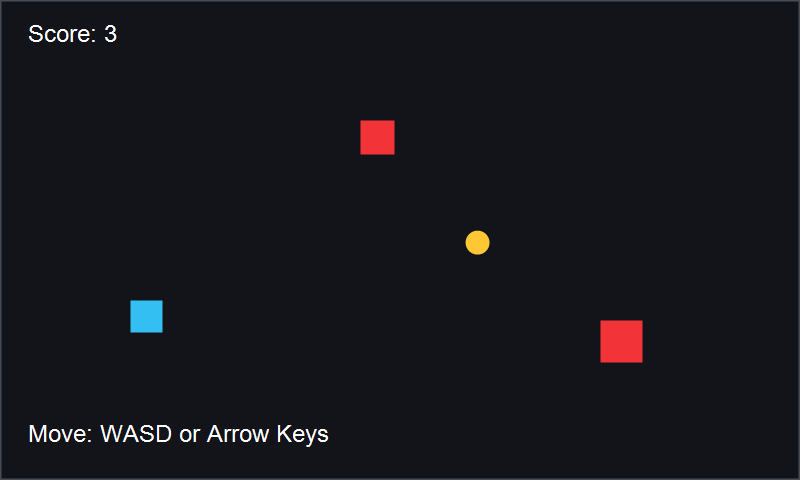

# Collector Demo

A small Java/libGDX desktop game demonstrating a complete 2D gameplay loop: keyboard input, frame-based movement, viewport management, collision detection, score tracking, and rendering with libGDX primitives.

The player controls a blue square, collects a yellow pickup for points, and avoids bouncing enemies. Colliding with an enemy resets the score and player position.

The project uses generated shapes and libGDX's default bitmap font, so there are no external image or audio assets required.



## Features

- Java/libGDX desktop project using Gradle
- Separate game classes for the main game, screen, player, enemies, and collectible
- Game loop using `render(delta)`
- Keyboard input with WASD and arrow keys
- Shape rendering for player, enemies, and collectible
- Rectangle collision detection
- Score counter rendered on screen
- Moving enemies that bounce inside the play area
- Reset behavior when the player collides with an enemy

## Technical Highlights

- Uses libGDX's `Game` and `Screen` lifecycle structure.
- Uses `FitViewport` to keep the game world at a consistent 800x480 size.
- Separates gameplay objects into `Player`, `Enemy`, and `Collectible` classes.
- Updates movement using `delta` time for frame-rate independent behavior.
- Uses `ShapeRenderer` for gameplay rendering and `SpriteBatch`/`BitmapFont` for UI text.
- Handles collision with libGDX `Rectangle` bounds.
- Cleans up disposable libGDX resources in `dispose()`.

## What This Demonstrates

- **Java OOP basics:** game objects are split into small classes with clear responsibilities.
- **libGDX game loop:** `GameScreen.render()` updates game state and then draws the frame.
- **Input handling:** `Player.update()` reads keyboard state each frame.
- **Shape rendering:** `ShapeRenderer` draws the player, enemies, and collectible without asset files.
- **Collision detection:** `Rectangle.overlaps()` checks player-collectible and player-enemy collisions.
- **Viewport handling:** `FitViewport` maintains a stable game world size across window changes.
- **Simple movement:** enemies move using velocity and bounce at screen edges.

## Requirements

- JDK 17 or newer
- No global Gradle install is required. The included Gradle Wrapper downloads the correct Gradle version on first run.

## Run Locally

From the project root:

```bash
./gradlew desktop:run
```

On Windows PowerShell:

```powershell
.\gradlew.bat desktop:run
```

Controls:

- Move with `WASD` or arrow keys
- Collect the yellow pickup to increase score
- Avoid red enemies or the score resets to zero

## Project Structure

```text
core/
  src/main/java/com/portfolio/collector/
    MainGame.java
    GameScreen.java
    Player.java
    Enemy.java
    Collectible.java
desktop/
  src/main/java/com/portfolio/collector/desktop/
    DesktopLauncher.java
build.gradle
settings.gradle
README.md
.gitignore
```

## Future Improvements

- Add a start screen and game-over screen
- Add increasing difficulty over time
- Add sound effects
- Replace shapes with small generated textures or custom pixel art
- Add unit tests for collision and respawn logic
